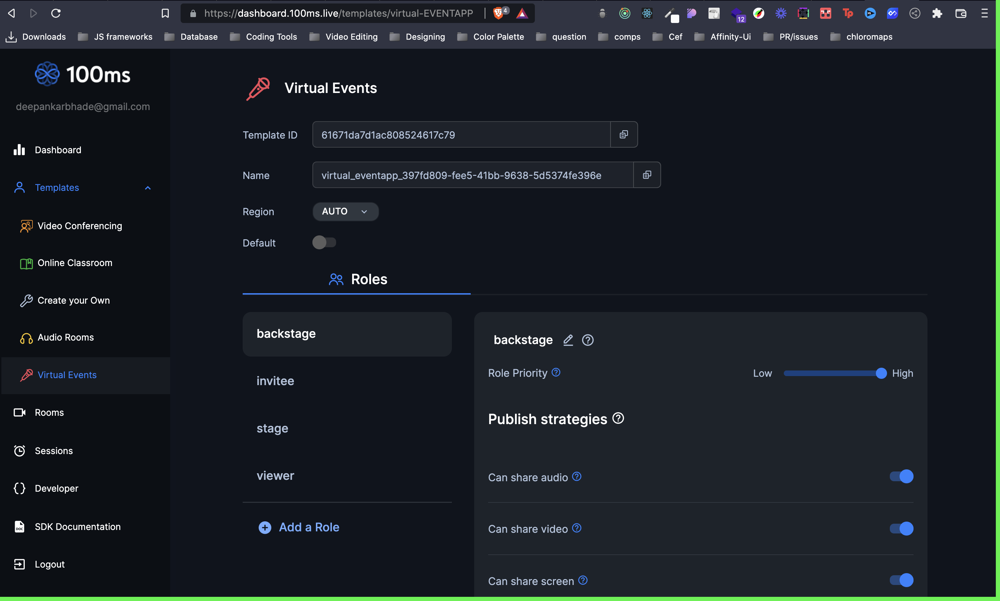
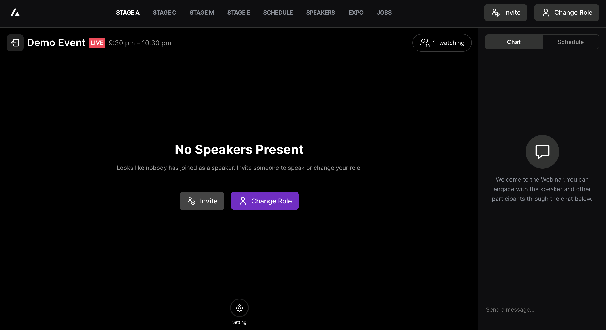
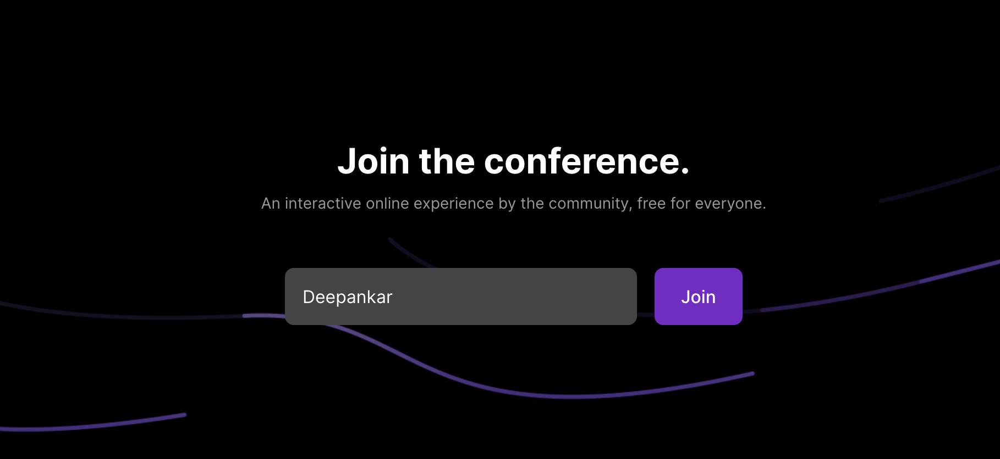
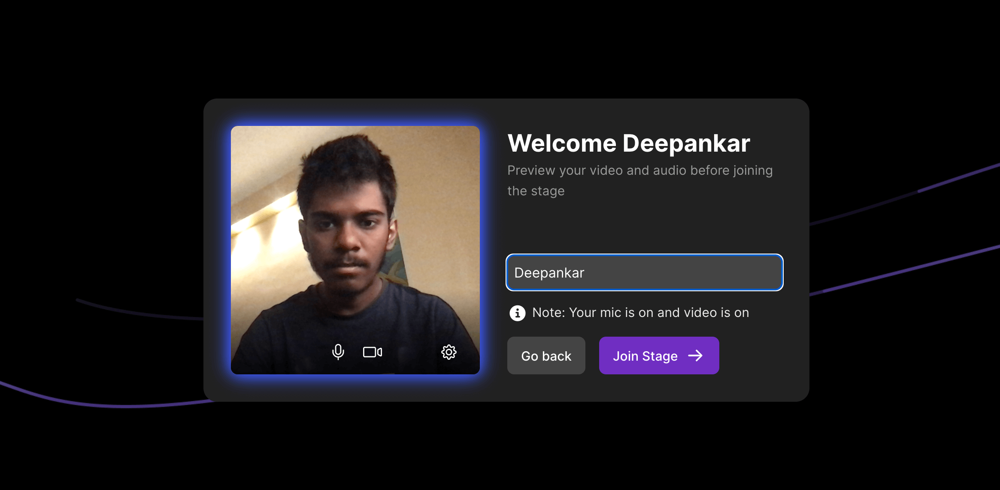
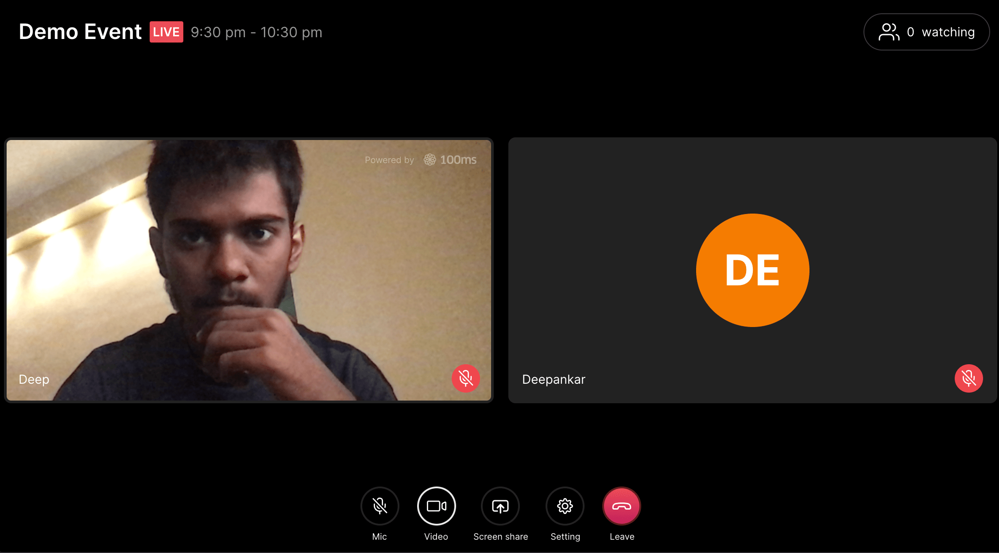
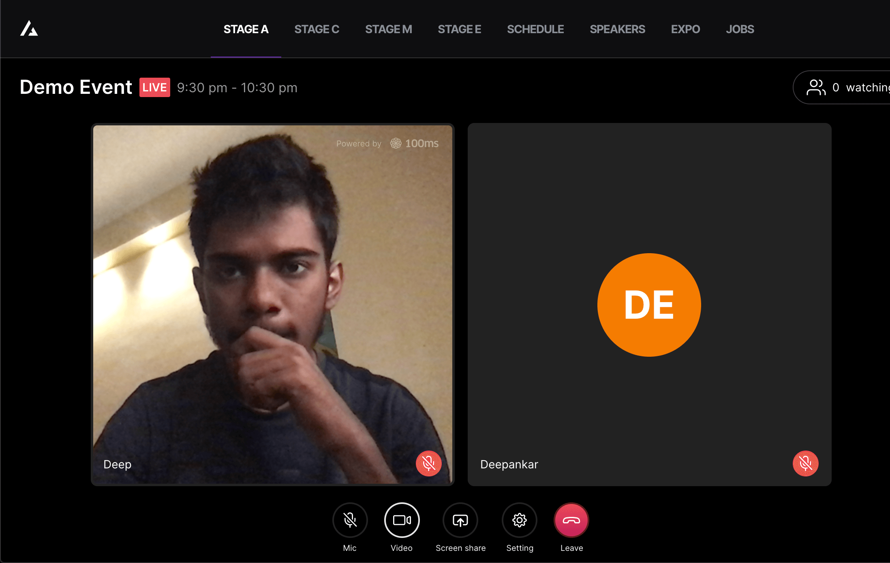
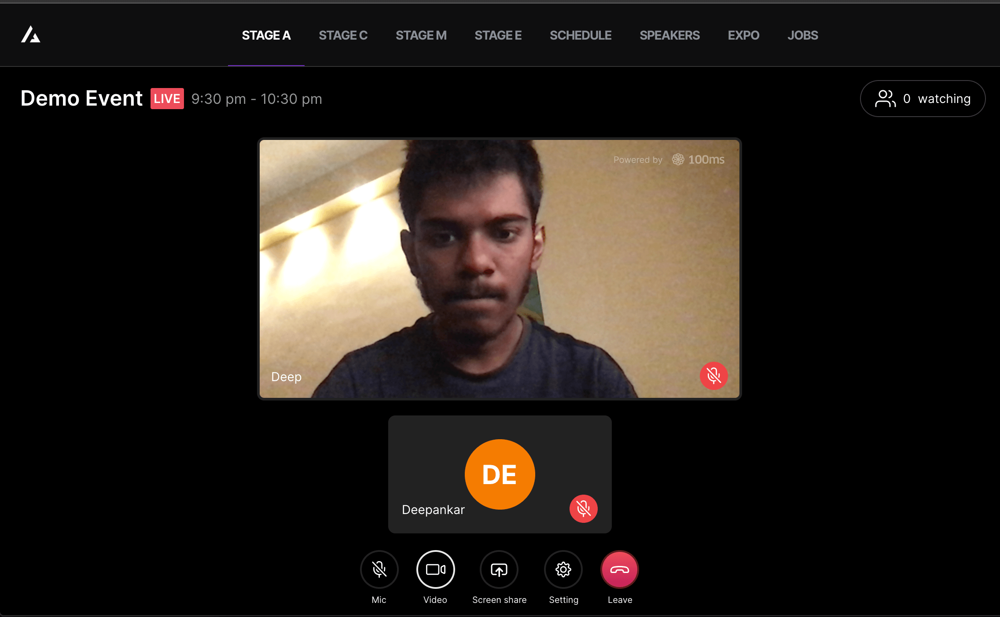
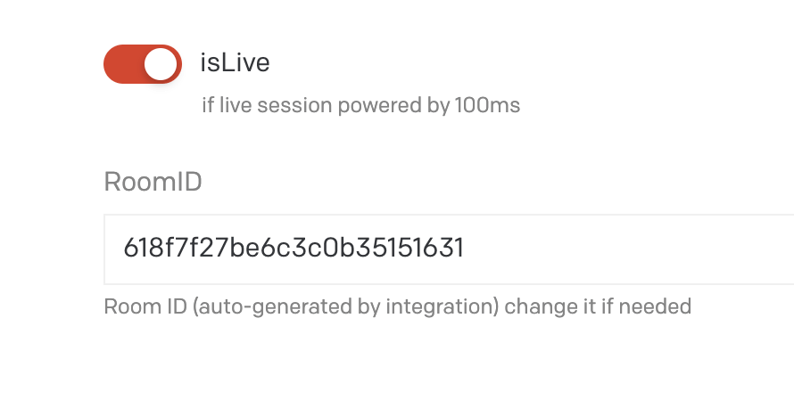

 <p align="center">
  
</p>

<h1 align="center">TechVerse</h1>

<p align="center">
  A virtual event platform for live stages, speakers, schedules, expo, and career opportunities.
</p>

<p align="center">
  <a href="https://github.com/YOUR_USERNAME/YOUR_REPOSITORY">
    
  </a>
  
  
</p>

<p align="center">
  
</p>

---

<table>
<tr>
<td width="50%" valign="top">

## Overview

TechVerse is a virtual event platform designed to bring event experiences together in one place. Users can explore event information, browse schedules and speakers, discover expo and career opportunities, and join live stages.

## Features

- **Event Hub:** Explore event sections and available content.
- **Schedule:** Browse event sessions and timing.
- **Speakers:** Discover event speakers.
- **Expo:** Explore expo content and participating organizations.
- **Jobs:** Browse career and job opportunities.
- **Live Stages:** Access stage pages and join live sessions.
- **LiveKit Integration:** Supports real-time audio/video experiences.
- **Responsive UI:** Designed for desktop and mobile screens.

## Tech Stack

| Technology   | Usage                         |
| ------------ | ----------------------------- |
| Next.js      | React framework and routing   |
| React        | User interface                |
| TypeScript   | Type-safe development         |
| Tailwind CSS | Styling and responsive design |
| Supabase     | Backend services and database |
| PostgreSQL   | Relational database           |
| LiveKit      | Real-time audio/video         |
| Vercel       | Deployment                    |

</td>
<td width="50%" valign="top">

## Screenshots

<p align="center">
  
  
</p>

<p align="center">
  
  
</p>

<p align="center">
  
  
</p>

<p align="center">
  
  
</p>

<p align="center">
  
</p>

</td>
</tr>
</table>

---

## Getting Started

### Prerequisites

- Node.js
- npm
- Supabase project credentials
- LiveKit credentials for live-stage functionality

### Installation

1. Clone the repository:

   ```bash
   git clone https://github.com/YOUR_USERNAME/YOUR_REPOSITORY.git
   ```

2. Move into the project directory:

   ```bash
   cd YOUR_REPOSITORY
   ```

3. Install dependencies:

   ```bash
   npm install
   ```

4. Create your environment file:

   ```bash
   cp .env.example .env.local
   ```

   On Windows PowerShell:

   ```powershell
   Copy-Item .env.example .env.local
   ```

5. Add the required environment variables to `.env.local`.

6. Start the development server:

   ```bash
   npm run dev
   ```

7. Open http://localhost:3000.

## Environment Variables

Configure the variables required by your project in `.env.local`.

```env
# Supabase
NEXT_PUBLIC_SUPABASE_URL=
NEXT_PUBLIC_SUPABASE_ANON_KEY=

# LiveKit
LIVEKIT_URL=
LIVEKIT_API_KEY=
LIVEKIT_API_SECRET=
```

Use `.env.example` as the source of truth for the complete variable list. Never commit `.env.local` or expose private server-side credentials.

## Available Scripts

```bash
npm run dev
npm run build
npm run start
npm run lint
```

Run only the scripts defined in your project's `package.json`.

## Project Structure

```text
.
├── public/
│   └── favicon.ico
├── media/
│   ├── dashboard.png
│   ├── stage.png
│   ├── join.png
│   ├── preview.png
│   ├── ar-1.png
│   ├── ar-2.png
│   ├── as-1.png
│   ├── as-2.png
│   └── cms.png
├── src/
├── .env.example
├── package.json
└── README.md
```

_Update the structure above if your actual folders differ._

## Security Notes

- Keep private API keys and secrets on the server.
- Do not commit environment files containing credentials.
- Protect authenticated and role-restricted routes on the server.
- Validate access before issuing LiveKit room tokens.

## Deployment

The application can be deployed to Vercel or another compatible hosting provider.

Before deployment:

1. Configure the required environment variables.
2. Verify authentication and access-control settings.
3. Test the production build.
4. Confirm live-stage functionality with valid LiveKit credentials.

## License

Add a license file if you intend to distribute this project under an open-source license.
